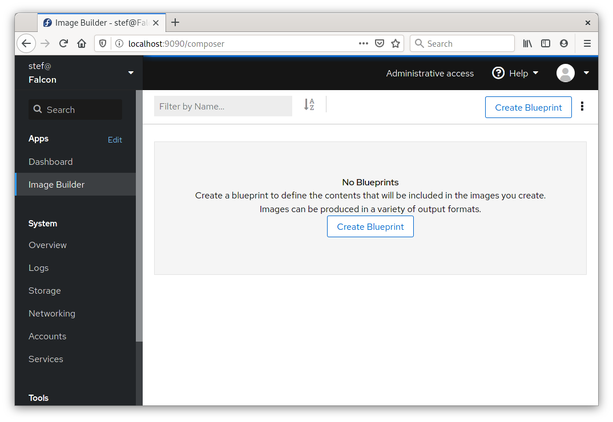
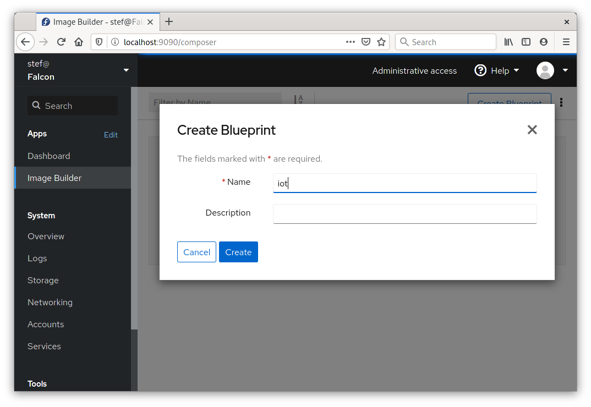
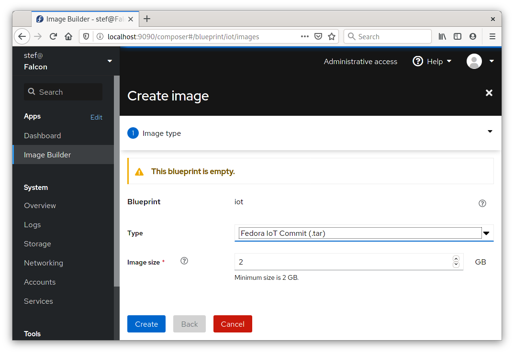
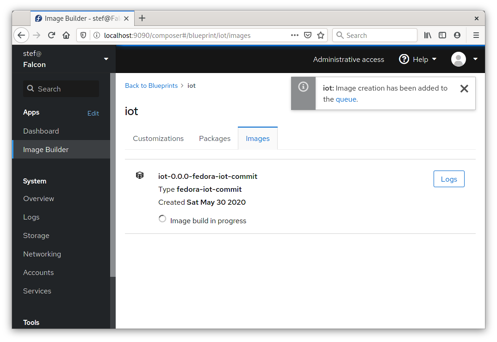
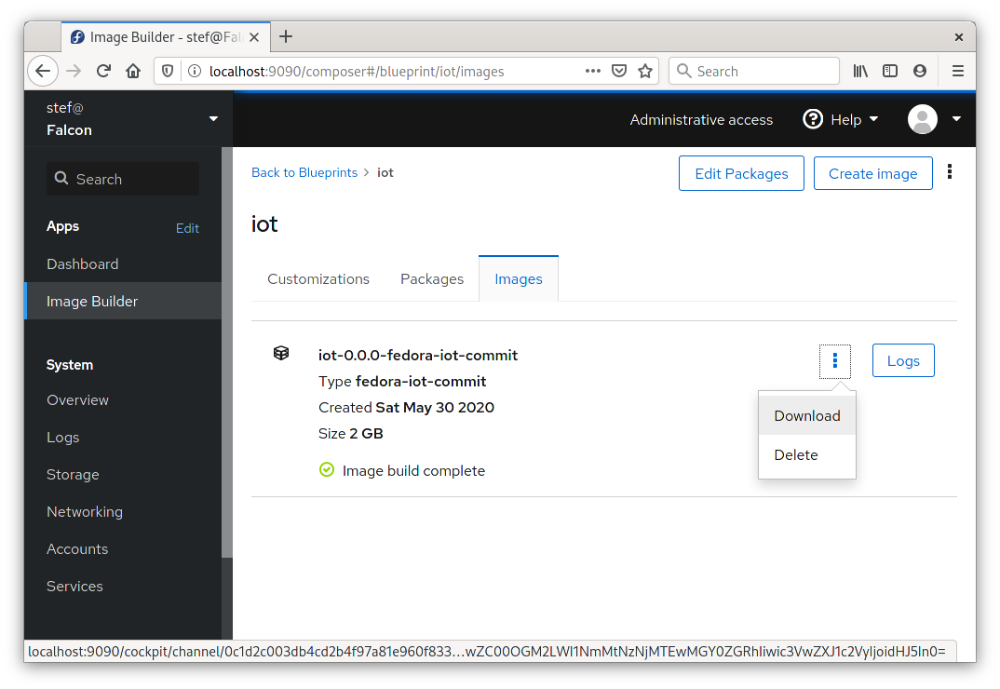
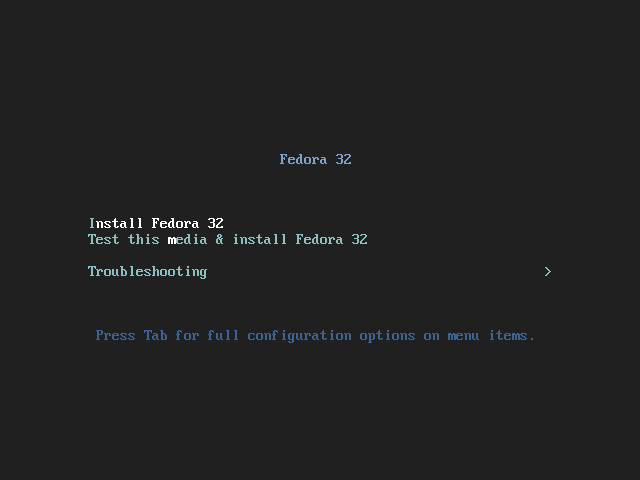
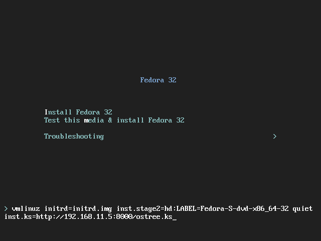
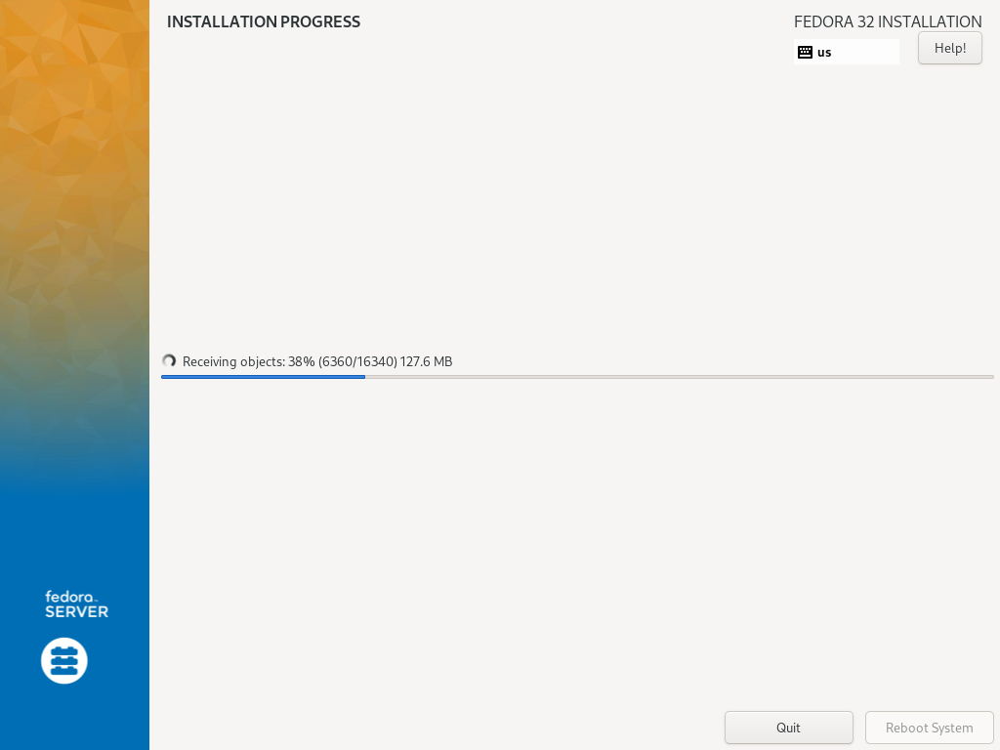

In version 15, *Image Builder* gained support for creating
[OSTree](https://ostree.readthedocs.io/en/latest/) commits.
You can install a Linux system using those OSTree commits by using
the [Anaconda Installer](https://fedoraproject.org/wiki/Anaconda)
and its
[Kickstart functionality](https://anaconda-installer.readthedocs.io/en/latest/kickstart.html).
This process is rather involved, with none of the individual parts
providing a complete solution yet, so let me walk you through it.

---

# Prerequisites

The naming of *Image Builder* and its various parts need
[some introduction](../documentation/) before they make sense. So I'll
list the actual package names you need for a complete working *Image Builder*
setup. We'll also use `podman` later on:

    $ sudo yum install osbuild osbuild-ostree osbuild-composer composer-cli podman
    $ sudo systemctl start osbuild-composer.socket

You will need one of the bootable install ISO images for
[Fedora](https://getfedora.org/) or [RHEL](https://developers.redhat.com/products/rhel/download).
I used a
[Fedora 32 netinst image](https://ftp.fau.de/fedora/linux/releases/32/Server/x86_64/iso/Fedora-Server-netinst-x86_64-32-1.6.iso) so get that downloading ahead of time.

Lastly, make note of the IP address of your system that is accessible
from other machines. This address will be peppered through various files
and commands:

    $ nmcli -p device show | grep IP4.ADDRESS
    IP4.ADDRESS[1]:                         192.168.11.5/24
    ...

# Create the OSTree in Image Builder GUI

You can create OSTree commits nicely in the Image Builder GUI. If
you'd rather do this via the command line, then skip this section.

    $ sudo yum install cockpit cockpit-composer
    $ sudo systemctl start cockpit

Use a web browser, to connect your machine on port 9090, and log in with
your usual Linux user name and password. Make sure your Linux user is an
administrative account on the local machine. Then click on *Image Builder* in the menu:

Click the *Create Blueprint* button to make a new blueprint and give it
a simple name. In the instructions below we use `iot` so for simplicity
just stick with that here:

You don't need to add any additional software to the blueprint to get a bootable
system. Click the *Create Image* button, and choose *Fedora IoT Commit* as
the image *Type*:

Once you click *Create* the image build will start, and take several minutes
to complete. You won't see any progress information or logs until its done,
so just be patient:

Once the image build is done, choose the option to *Download* the image which
is hidden in the kebab menu next to the *Logs* button. You'll get a tarball
named something like `8e8014f8-4d15-441a-a26d-9ed7fc89e23a-commit.tar`
which contains the OSTree commit that was just created. Save that file
to a local directory and we'll place a few additional files next to it
in later steps.

# Create the OSTree in Image Builder command line

If you created an OSTree via the GUI above, you can skip this section.
Here's how to create an OSTree via Image Builder from the command line.
The *Image Builder* command line tool is called `composer-cli`.

We first have to have a blueprint defined. To do this we write
an `iot.toml` file that defines what the image will contain:

    name = "iot"
    description = ""
    version = "0.0.0"
    packages = []
    modules = []
    groups = []

I've chosen the name `iot`, which is used in the steps below. For your
first go around just keep this simple name so you don't have to figure out all
the places below to change the name. Even though we haven't added any specific
`packages` to this blueprint, all the necessary packages to get a
bootable system will be automatically included.

Import the blueprint `iot.toml` file into Image Builder like this, and
start an image build for the `fedora-iot-commit` image type:

    $ sudo composer-cli blueprints push iot.toml
    $ sudo composer-cli compose start iot fedora-iot-commit
    Compose 8e8014f8-4d15-441a-a26d-9ed7fc89e23a added to the queue

You can check on status of the image build like so:

    $ sudo composer-cli compose status
    8e8014f8-4d15-441a-a26d-9ed7fc89e23a RUNNING  Sat May 30 07:03:54 2020 iot             0.0.0 fedora-iot-commit

Once the image has been created, download it into the current directory
using the UUID identifier that was displayed in the output of the previous
command. We'll be creating further files in the same directory below.

    $ sudo composer-cli compose image 8e8014f8-4d15-441a-a26d-9ed7fc89e23a
    8e8014f8-4d15-441a-a26d-9ed7fc89e23a-commit.tar: 587.60 MB

# Setting up the Kickstart

We'll install the OSTree in the Anaconda Installer using a Kickstart file.
Create a file called `ostree.ks` containing the following content
in the current directory:

    lang en_US.UTF-8
    keyboard us
    timezone UTC
    zerombr
    clearpart --all --initlabel
    autopart
    reboot
    user --name=core --groups=wheel --password=foobar
    ostreesetup --nogpg --url=http://192.168.11.5:8000/repo/ --osname=iot --remote=iot --ref=fedora/32/x86_64/iot

Replace the IP address in the last line with the address you saw in the
first section. This kickstart file must be in the same directory as
the OSTree tarball you downloaded from Image Builder above.

# Serving the OSTree via HTTP

OSTree doesn't come with a stock way to push or serve OSTree commits,
so we'll need to build our own mechanism to serve the
OSTree content. Lets use [Apache httpd](https://httpd.apache.org/) in
a container. The OSTree client can overwhelm certain HTTP servers
with too many connections. Don't get too fancy or opinionated
about using your favorite HTTP server here.

Create a `Dockerfile` with the following content. This file must be
in the same directory as the tarball and `ostree.ks` file:

    FROM registry.access.redhat.com/ubi8/ubi
    RUN yum -y install httpd && yum clean all
    ADD *.tar *.ks /var/www/html
    EXPOSE 80
    CMD ["/usr/sbin/httpd", "-D", "FOREGROUND"]

Now lets build and run the container:

    $ ls
    8e8014f8-4d15-441a-a26d-9ed7fc89e23a-commit.tar
    Dockerfile
    iot.toml
    ostree.ks
    $ podman build -t ostree .
    STEP 1: FROM registry.access.redhat.com/ubi8/ubi
    STEP 2: RUN yum -y install httpd && yum clean all
    ...
    $ podman run --rm -p 8000:80 ostree

In another terminal, check that you can access the content
using the IP address you discovered earlier:

    $ curl http://192.168.11.5:8000/ostree.ks
    lang en_US.UTF-8
    keyboard us
    timezone UTC
    ...
    $ curl http://192.168.11.5:8000/repo/config
    [core]
    repo_version=1
    mode=archive-z2

And we're ready to rock and roll!

# Installing from an OSTree

Boot a system using the ISO image you downloaded earlier. If you're using a
virtual machine or hardware you can do this in different ways that I won't
cover here.

At the initial screen that the Installer ISO displays, you'll see a line
something like *Install Fedora 32*:

Before the time out, use the arrow keys to select that line, and press
the TAB key. You'll see a line of kernel command line options appear below.
Something like:

    > vmlinuz initrd=initrd.img inst.stage2=hd:LABEL=Fedora quiet

Add the following to that line. Make sure to leave a space before it, and again
use the IP address you discovered earlier:

    inst.ks=http://192.168.11.5:8000/ostree.ks

After you press ENTER, the installer should start. If things are working the
GUI should display but proceed automatically to the installation stage. You'll
see text about the system being installed from the OSTree repo, and how it's
pulling various objects.

Once the system is installed, it'll reboot automatically. To log into your
newly minted system use the login `core` and the password `foobar`
that you saw in the `ostree.ks` file.
